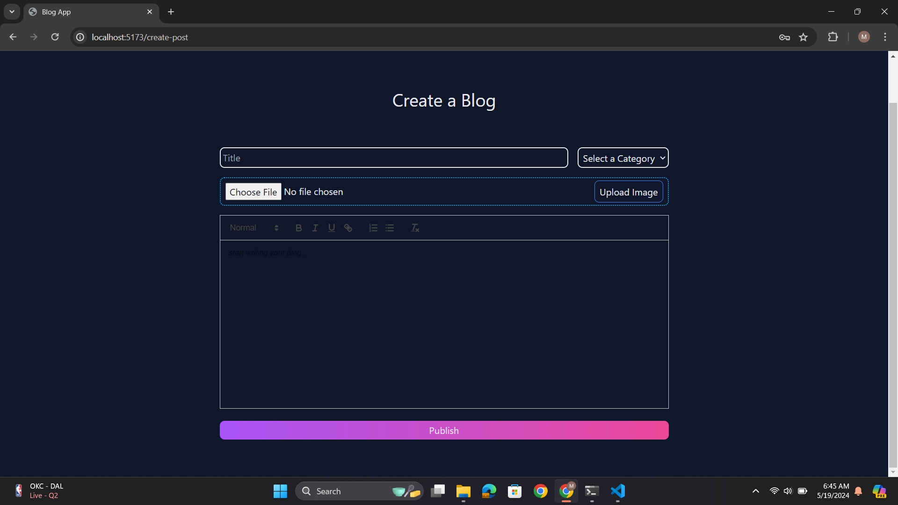

# About Me

> This is Mukesh Kushwaha. I am an IT engineer by qualification and MERN stack developer by profession.

## About Project

> It is a Blog App with admin dashboard build using MERN stack technology.

### Features

1. Authentication using jsonwebtoken
2. Admin dashboard
3. Advance searching and filtering
4. light and dark mode.

Home Page

Sign In Page

Dashboard

create post

